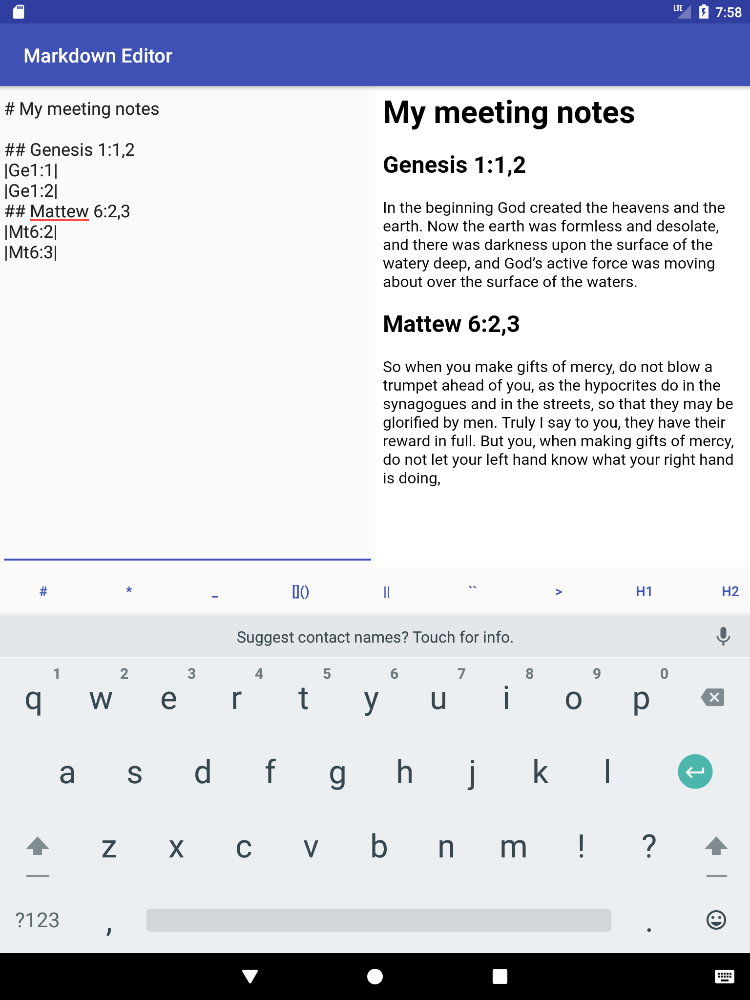

# MarkdownEditor

Markdown editor to making notes on Jehovah Witness meetings.

## Done:
- Custom extension for single Bible verses.
- Simple persistance of current note.

## Things to do:
- Custom extension improvements.
- Exporting notes.
- Themes of notes.
- Downloading Bible from internet.
- Changing language of Bible.
- UI Control to choose quote.
- Many other things.

If you have some free time, You can try do it yourself :smile:
General idea is like this 😁

> 
